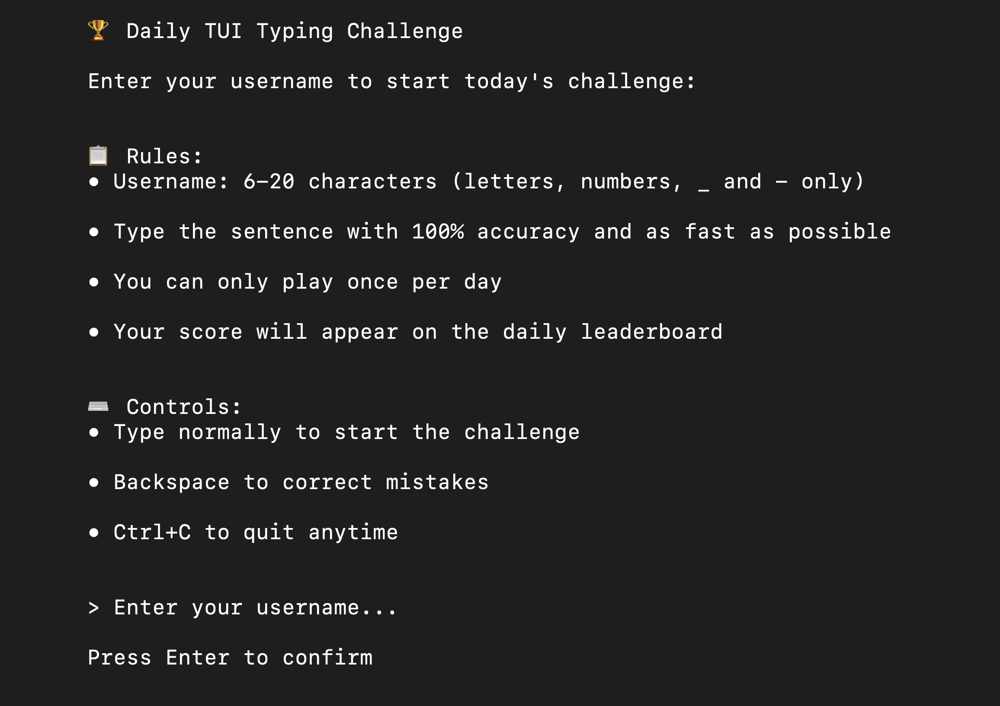
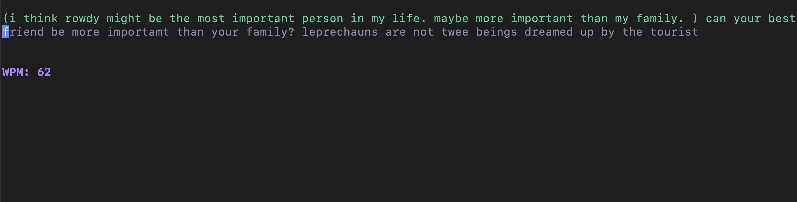
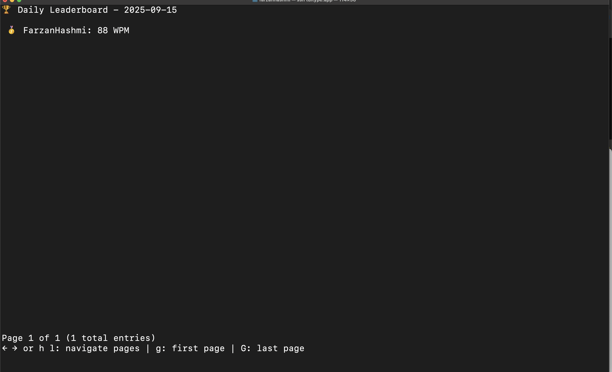

```bash
ssh tuitype.app
```

### Daily TUI Typing Challenge

This is a minimal, typing game that you can play directly from your terminal over SSH (built with [BubbleTea](https://github.com/charmbracelet/bubbletea) and [Wish](https://github.com/charmbracelet/wish)). It features a new typing challenge every day and a daily leaderboard to see how you stack up against other players.

**Username Prompt & Rules:**  


**Typing Challenge in Action:**  


**Daily Leaderboard:**  


---
